# 408 数据结构知识点（结构化笔记）

> 更新：2025-11-11

## 目录

- [408 数据结构知识点（结构化笔记）](#408-数据结构知识点结构化笔记)
	- [目录](#目录)
	- [绪论](#绪论)
		- [数据结构在学什么](#数据结构在学什么)
		- [数据结构的基本概念](#数据结构的基本概念)
		- [数据结构的三要素](#数据结构的三要素)
		- [数据类型与 ADT](#数据类型与-adt)
		- [算法的基本概念](#算法的基本概念)
		- [算法的时间复杂度](#算法的时间复杂度)
		- [算法的空间复杂度](#算法的空间复杂度)
	- [线性表](#线性表)
		- [定义和基本操作](#定义和基本操作)
		- [顺序表：定义 {#顺序表定义}](#顺序表定义-顺序表定义)
		- [顺序表：实现（静态/动态） {#顺序表实现静态动态}](#顺序表实现静态动态-顺序表实现静态动态)
		- [顺序表：特点（优缺点） {#顺序表特点优缺点}](#顺序表特点优缺点-顺序表特点优缺点)
		- [顺序表：插入与删除 {#顺序表插入与删除}](#顺序表插入与删除-顺序表插入与删除)
		- [顺序表：查找 {#顺序表查找}](#顺序表查找-顺序表查找)
	- [单链表](#单链表)
		- [单链表的定义 {#单链表定义}](#单链表的定义-单链表定义)
		- [单链表：带头结点 vs 不带头结点 {#单链表头结点}](#单链表带头结点-vs-不带头结点-单链表头结点)
		- [单链表：插入操作 {#单链表插入}](#单链表插入操作-单链表插入)
			- [按位序插入（带头结点）](#按位序插入带头结点)
			- [按位序插入（不带头结点）](#按位序插入不带头结点)
			- [指定结点的后插操作](#指定结点的后插操作)
			- [指定结点的前插操作](#指定结点的前插操作)
		- [单链表：删除操作 {#单链表删除}](#单链表删除操作-单链表删除)
			- [按位序删除（带头结点）](#按位序删除带头结点)
			- [指定结点的删除](#指定结点的删除)
		- [单链表：查找操作 {#单链表查找}](#单链表查找操作-单链表查找)
			- [按位查找](#按位查找)
			- [按值查找](#按值查找)
			- [求表的长度](#求表的长度)
		- [单链表：建立 {#单链表建立}](#单链表建立-单链表建立)
			- [尾插法](#尾插法)
			- [头插法](#头插法)

---

## 绪论

### 数据结构在学什么

- 如何用程序代码把现实世界的问题信息化。
- 如何用计算机高效地处理这些信息从而创造价值。

### 数据结构的基本概念

- 什么是数据：数据是信息的载体，是描述客观事物属性的数、字符及所有能输入到计算机中并被计算机程序识别和处理的符号的集合。数据是计算机程序加工的原料。
- 现代计算机处理的数据：
	- 现代计算机经常处理非数值型问题。
	- 对于非数值型的问题：既关心每个个体的具体信息，也关心个体之间的关系。
- 数据元素：数据的基本单位，通常作为一个整体进行考虑和处理。
- 数据项：一个数据元素可由若干数据项组成，数据项是构成数据元素的不可分割的最小单位。
- 数据对象：具有相同性质的数据元素的集合，是数据的一个子集。
- 数据结构：相互之间存在一种或多种特定关系的数据元素的集合。本课程关注的是数据元素之间的关系与对这些数据元素的操作，而不关心具体的数据项内容。

### 数据结构的三要素

1) 逻辑结构：
	 - 集合结构：各个元素同属一个集合，别无其他关系。
	 - 线性结构：一对一，顺序关系。
	 - 树状结构：一对多。
	 - 图状结构：多对多。

2) 数据的运算：针对某种逻辑结构，结合实际需求，定义基本运算（增、删、改、查）。

3) 物理结构（存储结构）：如何用计算机实现这种数据结构。
	 - 顺序存储：把逻辑上相邻的元素存储在物理位置上也相邻的存储单元中，元素之间的关系由存储单元的邻接关系体现。
	 - 链式存储：逻辑上相邻的元素在物理位置上可以不相邻，借助指示元素存储地址的指针表示逻辑关系。
	 - 索引存储：在存储元素信息的同时，建立附加的索引表。索引项一般形式是（关键字，地址）。
	 - 散列存储（哈希存储）：根据元素的关键字直接计算出该元素的存储地址。

小结：

- 若采用顺序存储，则各个数据元素在物理上必须连续；若采用非顺序存储则物理上可以离散。
- 存储结构会影响存储空间分配的方便程度与运算速度。
- 运算的定义是针对逻辑结构，指出功能；运算的实现是针对存储结构，指出具体步骤。

### 数据类型与 ADT

- 数据类型：一个值的集合和定义在此集合上的一组操作的总称。
	- 原子类型：其值不可再分（如 `bool`、`int`）。
	- 结构类型：其值可以再分解为若干分量（如 `struct`）。
- 抽象数据类型（ADT）：是抽象的数据组织及其相关操作。定义一个 ADT 即定义一种数据结构。

### 算法的基本概念

- 程序 = 数据结构 + 算法。
- 算法（Algorithm）：对特定问题求解步骤的描述，是指令的有限序列，其中每条指令表示一个或多个操作。

算法的特征：

- 有穷性：必须在有穷步后结束，且每一步可在有穷时间内完成。
- 确定性：每条指令有确切含义，相同输入得到相同输出。
- 可行性：操作能通过已实现的基本运算在有限次内实现。
- 输入：零个或多个，取自某个特定对象的集合。
- 输出：一个或多个，与输入有特定关系的量。

好算法的特质：

- 正确性：能正确解决问题。
- 可读性：便于人理解与维护。
- 健壮性：遇到非法输入能适当处理而非产生莫名输出。
- 高效率：
	- 时间效率：时间复杂度低。
	- 空间效率：空间复杂度低。

### 算法的时间复杂度

- 定义：事前预估算法时间开销 $T(n)$ 与问题规模 $n$ 的关系。

规则：

- 加法规则：

	$$
	T(n)=T_1(n)+T_2(n)=O\big(f(n)\big)+O\big(g(n)\big)=O\big(\max\{f(n),g(n)\}\big)
	$$

- 乘法规则：

	$$
	T(n)=T_1(n)\times T_2(n)=O\big(f(n)\big)\times O\big(g(n)\big)=O\big(f(n)\cdot g(n)\big)
	$$

- 常见数量级：

	$$
	O(1) < O(\log_2 n) < O(n) < O(n\log_2 n) < O(n^2) < O(n^3) < O(2^n) < O(n!) < O(n^n)
	$$

- 估算时仅需关注循环内最深层嵌套部分。
- 最坏时间复杂度：最坏情况下的运行时间。
- 平均时间复杂度：所有输入等概率时的期望运行时间。
- 最好时间复杂度：最好情况下的运行时间。
- 一般只关注最坏与平均复杂度。

### 算法的空间复杂度

- 定义：空间开销（内存开销，$S(n)$）与问题规模 $n$ 之间的关系。
- 原地工作：算法所需额外内存空间为常量级 $O(1)$。

规则：

- 只需关注与问题规模相关的变量所占空间。
- 加法/乘法规则与时间复杂度一致。
- 多数递归调用：空间复杂度约等于递归调用的最大深度。

---

## 线性表

### 定义和基本操作

- 定义：线性表（Linear List）是具有相同数据类型的 $n\,(n\ge 0)$ 个数据元素的有限序列。当 $n=0$ 时为空表。
- 记作：$L=(a_1,a_2,\dots,a_i,a_{i+1},\dots,a_n)$。
- 术语：
	- 表头元素：$a_1$；表尾元素：$a_n$。
	- 除第一个元素外，每个元素有且仅有一个直接前驱；除最后一个元素外，每个元素有且仅有一个直接后继。

基本操作（示例原型）：

- `InitList(&L)`：初始化表，构造空表并分配空间。
- `DestroyList(&L)`：销毁线性表并释放空间。
- `ListInsert(&L, i, e)`：在第 `i` 个位置插入元素 `e`。
- `ListDelete(&L, i, &e)`：删除第 `i` 个位置元素，并用 `e` 返回其值。
- `LocateElem(L, e)`：按值查找，返回位置或标记。
- `GetElem(L, i)`：按位查找，获取第 `i` 个元素的值。
- `Length(L)`：返回表长。
- `PrintList(L)`：按前后顺序输出所有元素值。
- `Empty(L)`：判空，若空表返回 `true`，否则返回 `false`。

提示：当需要“把修改带回去”时（如初始化、插入、删除），形参需以引用或指针方式传入（如 `&L`）。

### 顺序表：定义 {#顺序表定义}

- 用顺序存储方式实现线性表：把逻辑上相邻的元素，存储在物理位置也相邻的存储单元中；元素间关系由存储单元的邻接关系体现。
- 如何知道一个数据元素大小：在 C 语言中使用 `sizeof(ElemType)`。

### 顺序表：实现（静态/动态） {#顺序表实现静态动态}

静态分配：

- 使用固定长度的数组保存元素。
- 若“数组”存满：顺序表的表长在一开始确定后无法更改；若初始化过大又可能浪费空间。因此常转为动态分配以便扩容。


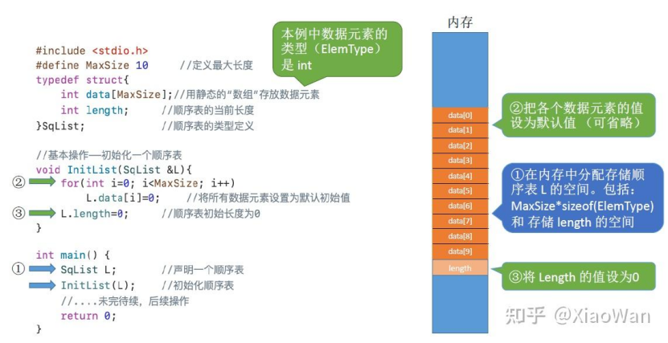
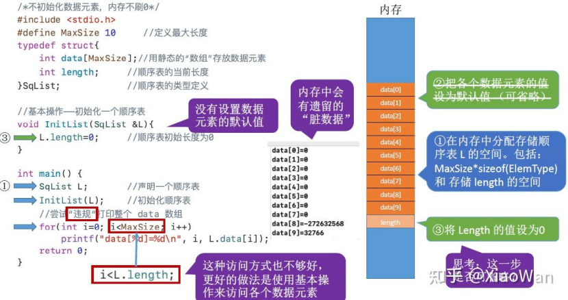


动态分配:
- 动态申请与释放内存

  C：`malloc` / `free`

	```c
	L.data = (ElemType*)malloc(sizeof(ElemType) * InitSize);
	// malloc 返回 void*，在 C++ 或需要时进行类型转换
	```

	- `malloc` 的参数指明要分配多大的连续内存空间。

  C++：`new` / `delete`


- 初始分配一定容量，按需扩容（通常成倍扩容），并在扩容时搬移旧元素到新内存块。
- 正是由于顺序表按连续内存存放，初始化时常需要将 `malloc` 的返回值强制转换为与数据元素类型对应的指针。


### 顺序表：特点（优缺点） {#顺序表特点优缺点}

- 随机访问：可在 $O(1)$ 时间内找到第 `i` 个元素。
- 存储密度高：每个结点只存储数据元素本身。
- 拓展容量不方便：即便动态分配，扩容需要搬移，代价较高（摊还分析可降低单次均摊）。
- 插入、删除操作不便：在中间位置操作需移动大量元素。

### 顺序表：插入与删除 {#顺序表插入与删除}

- 插入：在第 `i` 个位置插入元素，需要先检查 `i` 的合法性（1 ≤ i ≤ 长度+1），再从尾到头移动元素空出位置。
  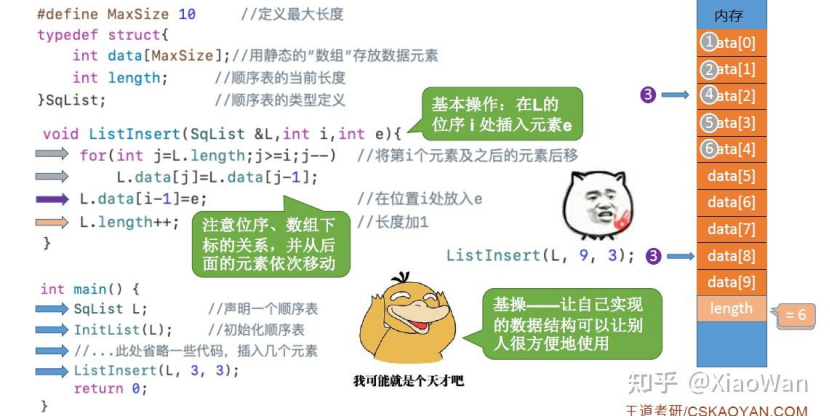
增加i的合法性判断：
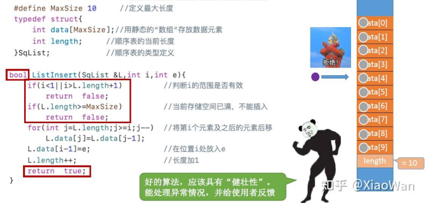
- 删除：删除第 `i` 个位置元素，需要检查 `i` 的合法性（1 ≤ i ≤ 长度），再从头到尾移动元素填补空洞。
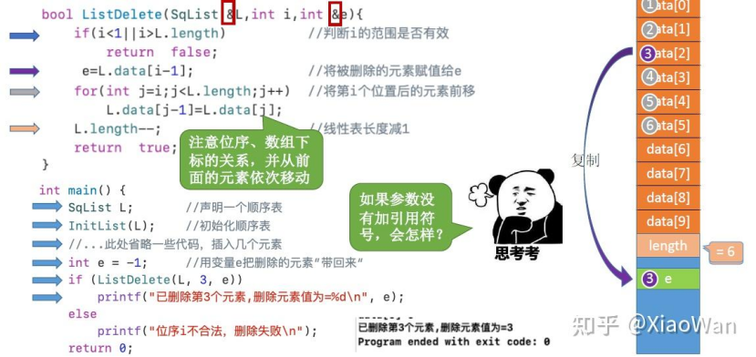

时间复杂度：

- 最好：$O(1)$（在表尾插入/删除）。
- 最坏：$O(n)$（在表头或靠前位置插入/删除）。
- 平均：$O(n)$。

### 顺序表：查找 {#顺序表查找}

按位查找：

- 根据起始地址与元素大小可直接定位第 `i` 个元素（随机存取），时间复杂度 $O(1)$。
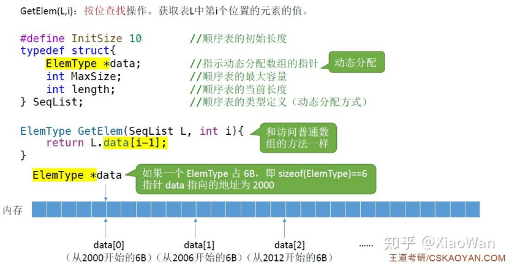
按值查找：
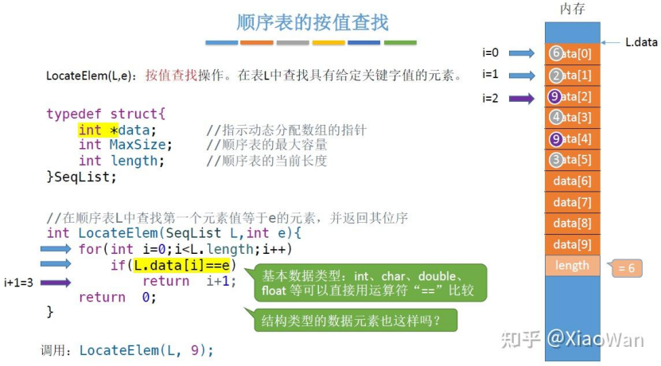
- 线性扫描对比关键字。
- 若数据元素为结构类型，C 语言中不能直接用 `==` 比较整个结构体（C++ 可通过 `operator==` 重载），应定义比较函数，依次对比各分量判断是否相等。
- 复杂度：最好 $O(1)$，最坏 $O(n)$，平均 $O(n)$。

---

## 单链表

### 单链表的定义 {#单链表定义}

**顺序表 vs 单链表：**

| 特性 | 顺序表 | 单链表 |
|------|--------|--------|
| 存储内容 | 每个结点中只存放数据元素 | 每个结点除了存放数据元素外，还要存储指向下一个结点的指针 |
| 优点 | 可随机存取，存储密度高 | 不要求大片连续空间，改变容量方便 |
| 缺点 | 要求大片连续空间，改变容量不方便 | 不可随机存取，要耗费一定空间存放指针 |

**定义一个单链表：**

- `typedef` 关键字：数据类型重命名
  ```c
  typedef <数据类型> <别名>
  typedef struct LNode LNode;
  // 之后可以用 LNode 代替 struct LNode
  ```

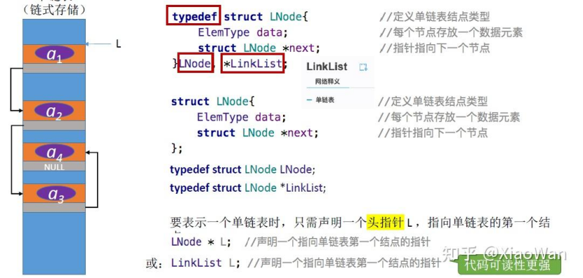

```c
//简洁版
typedef struct LNode{
ElemType data;
struct LNode *next;
}LNode,*LinkList;
//LNode 代表结点类型
//LinkList 代表单链表类型

//分布版本
struct LNode{
	ElemType data;
	struct LNode *next;
};
typedef struct LNode LNode;
typedef struct LNode *LinkList;
```

### 单链表：带头结点 vs 不带头结点 {#单链表头结点}

**不带头结点的单链表：**

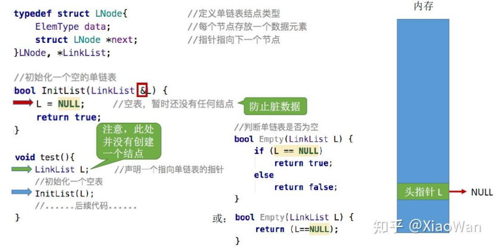
```c
typedef struct LNode{
	ElemType data;
	struct LNode *next;
} LNode,*LinkList;

bool InitList(LinkList *L){
	L = NULL; // 空表，头指针指向 NULL
	return true;
}
```

**带头结点的单链表：**
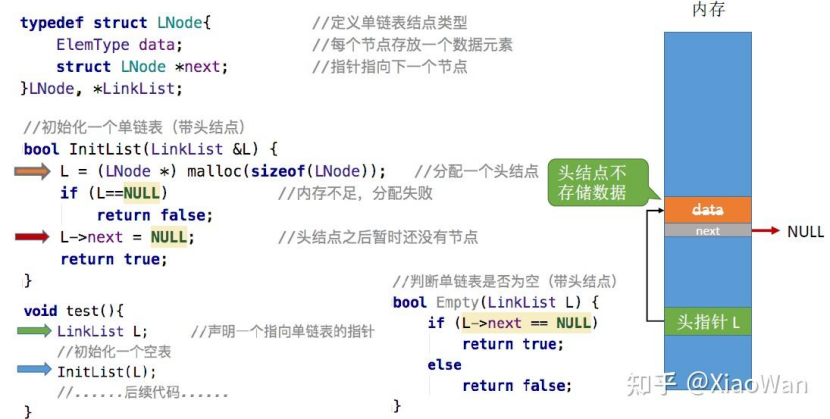

```c
typedef struct LNode{
	ElemType data;`
	struct LNode *next;
} LNode,*LinkList;

bool initList(LinkList *L){
	*L =  (LNode *)malloc(sizeof(LNode));
	if(*L == NULL)
		return false;
	(*L)->next = NULL;
	return true;
}
```

**区别：**

- **不带头结点**：写代码更麻烦
  - 对第一个数据结点和后续数据结点的处理需要用不同的代码逻辑。
  - 对空表和非空表的处理需要用不同的代码逻辑。
- **带头结点**：推荐使用
  - 头结点可以看作"第 0 个"结点，统一了操作逻辑。
  - 我们一般使用的都是带头结点的单链表。

### 单链表：插入操作 {#单链表插入}

#### 按位序插入（带头结点）

- `ListInsert(&L, i, e)`：在表 L 中的第 `i` 个位置上插入指定元素 `e`。
- 找到第 `i-1` 个结点，将新结点插入其后。
- 若带有头结点，插入更加方便，头结点可以看作"第 0 个"结点，直接做上面的操作即可。
- 若带有头结点,插入更加方便，头结点可以看作"第 0 个"结点，直接做上面的操作即可。


**边界情况分析：**

- 若 `i` 插在表头：与正常操作一样，可以插入成功。
- 若 `i` 插在表尾：`s->next` 为 `NULL`（在表的定义时规定的），可以插入成功。
- 若 `i` 插在表外（`i > Length`）：`p` 指针指向 `NULL`（while 循环一直指向 `p->next`），不能插入成功。

**时间复杂度：**

- 最好：$O(1)$
- 最坏：$O(n)$
- 平均：$O(n)$
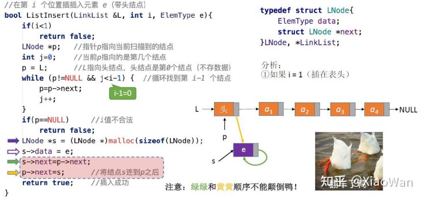

```c
bool listInsert(LinkList *L,int i,ElemType e){
	if(i<1)
	return false
LNode *p = *L; // p 指向头结点
int j = 0;
while(p!=NULL && j<i-1){
	p = p->next;
	j++
}
if(p==NULL) // i 比表长大，无法插入
	return false;
}
LNode *s = (LNode *)malloc(sizeof(LNode));
s->data = e; // 新结点赋值
s->next = p->next; // 新结点指向后继结点
p->next = s; // 前驱结点指向新结点
return true;
```
#### 按位序插入（不带头结点）

- `ListInsert(&L, i, e)`：在表 L 中的第 `i` 个位置上插入指定元素 `e`。
- 不存在"第 0 个"结点，因此 `i=1` 时需要特殊处理。
- 找到第 `i-1` 个结点，将新结点插入其后。

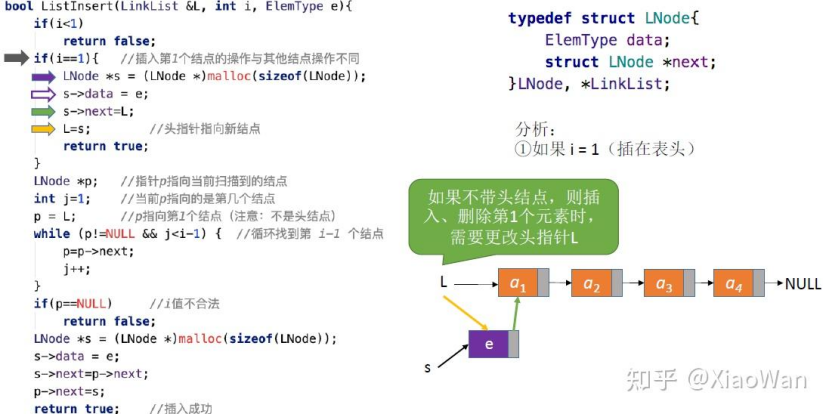

```c
bool listInsert(LinkList *L,int i,ElemType e){
	if(i<1)
	return false
if(i == 1){
	LNode *s = (LNode *)malloc(sizeof(LNode));
	s->data = e; // 新结点赋值
	s->next = *L; // 新结点指向原头结点
	*L = s; // 头指针指向新结点
	return true;
}
LNode *p = *L; // p 指向头结点
int j = 1;
while(p != NULL && j < i-1){
	p = p->next;
	j++
}
if(p==NULL){ // i 比表长大，无法插入
	return false;
}
LNode *s = (LNode *)malloc(sizeof(LNode));
s->data = e;
s->next = p->next; // 新结点指向后继结点
p->next = s; // 前驱结点指向新结点
return true;;
}

```

**注意：**

- 若 `i != 1`，则处理方法和带头结点一模一样。
- 值得注意的是 `int j = 1` 而非带头结点的 `0`（带头结点的头结点为第 0 个结点）。
- **结论**：不带头结点写代码更不方便，推荐用带头结点。

#### 指定结点的后插操作

```c
// 这一段代码是按位序插入中插入的那一部分代码
// 也可以直接调用 InsertNextNode 来执行
// 封装代码，以此提高代码复用性，让代码更容易维护
```

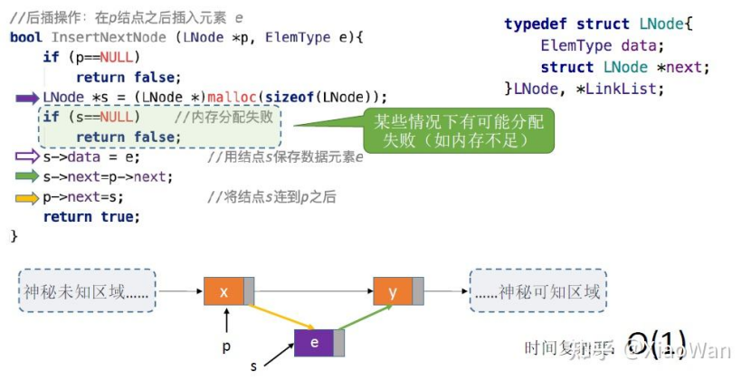

```c
bool InsertNextNode(LNode *p,ElemType e){
	if(p == NULL)
		return false;
	LNode *s = (LNode *)malloc(sizeof(LNode));
	s->data = e;
	s->next = p->next; // 新结点指向后继结点
	p->next = s; // 前驱结点指向新结点
	return true;             
}
```

#### 指定结点的前插操作

**问题**：因为仅知道指定结点的信息和后继结点的指向，因此无法直接获取到前驱结点。

**方法 1**：获取头结点然后再一步步找到指定结点的前驱。

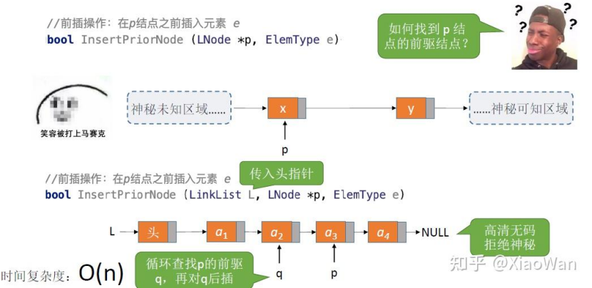

**方法 2**：偷天换日
1. 将新结点 `s` 先连上指定结点 `p` 的后继。
2. 接着指定结点 `p` 连上新结点 `s`。
3. 将 `p` 中元素复制到 `s` 中。
4. 将 `p` 中元素覆盖为要插入的元素 `e`。

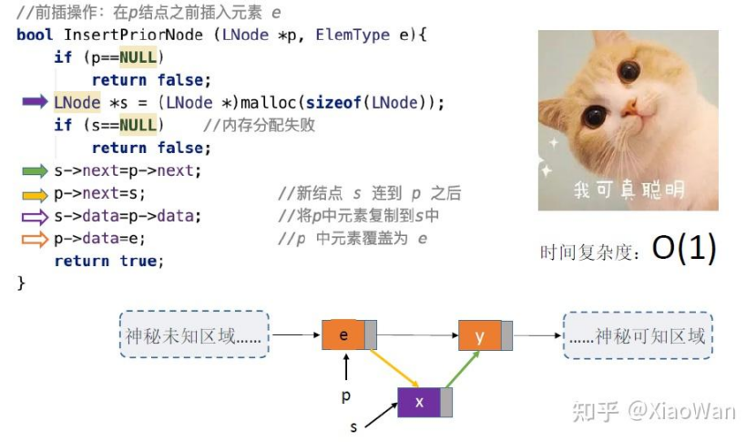

```c
bool insertPriorNode(LNode *p,ElemType e){
	if(p == NULL)
		return false;
	LNode *s = (LNode *)malloc(sizeof(LNode));
s->data = p->data; // 复制结点数据到新结点
s->next = p->next; // 新结点指向后继结点
p->next = s; // 指定结点指向新结点
p->data = e; // 指定结点赋值为插入元素
return true;
}
```
### 单链表：删除操作 {#单链表删除}

#### 按位序删除（带头结点）

- `ListDelete(&L, i, &e)`：删除表 L 中第 `i` 个位置的元素，并用 `e` 返回删除元素的值。
- 找到第 `i-1` 个结点，将其指针指向第 `i+1` 个结点，并释放第 `i` 个结点。

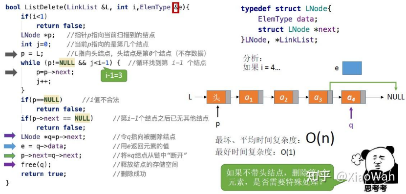

```c
bool listDelete(LinkList *L,int i,ElemType *e){
	if(i<1)
	return false
LNode *p = *L; // p 指向头结点
int j = 0; // j 记录当前结点位置
while(p != NULL && j < i - 1){
	p = p->next;
	j++;
}
if(p->next == NULL)
return false;
LNode *q = p->next;
*e = q->data; // 记录删除结点的数据
p->next = q->next; // 前驱结点指向后继结点
free(q); // 释放删除结点
return true;
}
```
#### 指定结点的删除

**问题**：删除结点 `p`，需要修改其前驱结点的 `next` 指针，和指定结点的前插操作一样。

**方法 1**：传入头指针，循环寻找 `p` 的前驱结点。

**方法 2**：偷天换日，类似于结点前插的实现。

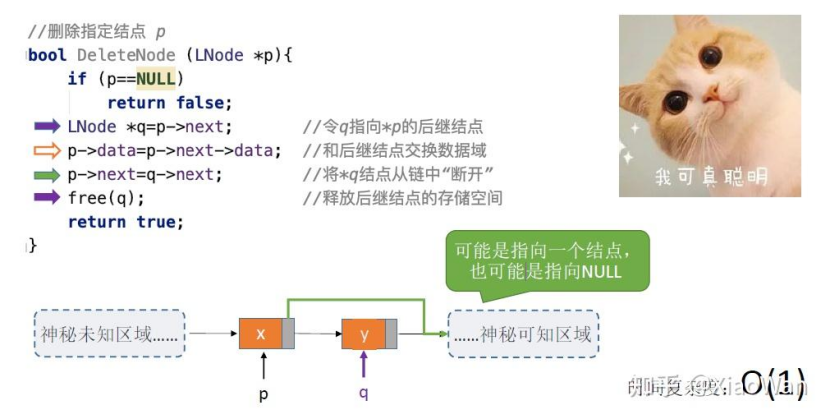

```c
//把i节点换成i+1节点，然后删除i+1节点
bool DeleteNode(LNode *p){
if(p == NULL)
return false;
LNode *q = p->next;
p->data = q->data;
p->next = q->next;
free(q);
return true;
}
```

**特殊情况**：如果要删除的结点 `p` 是最后一个结点
- 只能从表头开始依次寻找 `p` 的前驱，时间复杂度 $O(n)$。
- 这就体现了单链表的局限性：**无法逆向检索**，有时候不太方便。

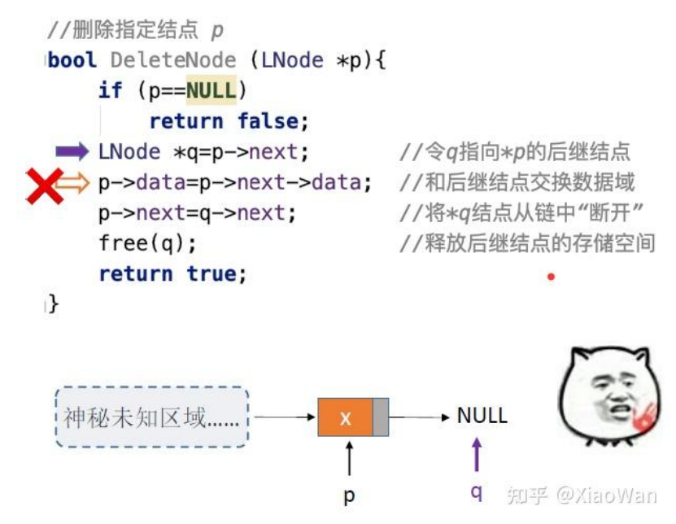
### 单链表：查找操作 {#单链表查找}

#### 按位查找

- `GetElem(L, i)`：按位查找操作，获取表 L 中第 `i` 个位置的元素的值。
- 实际上单链表的插入中找到 `i-1` 部分就是按位查找 `i-1` 个结点。

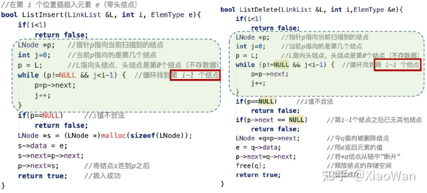

```c
LNode * GetElem(LinkList L,int i){
	if(i<0)
	return NULL;
LNode *p = L; //当前扫描到的节点
int j = 0;
while(p != NULL && j<i){
	p = p -> next
	j++
}
return p;
}
```

**查找第 `i` 个结点：**

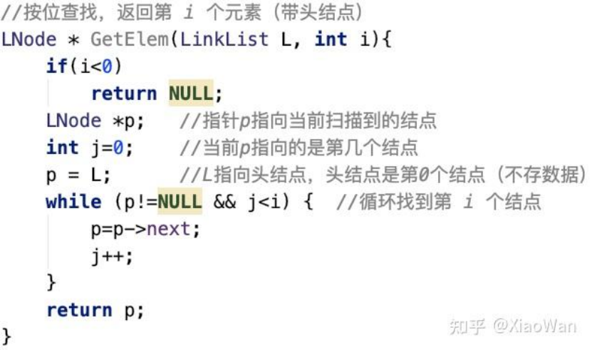

**边界情况：**

- 如果 `i=0`：直接不满足 `j<i`，指针 `p` 直接返回头结点 `L`。
- 如果 `i` 超界：当时 `p` 指向了 `NULL`，指针 `p` 返回 `NULL`。

**平均时间复杂度**：$O(n)$

#### 按值查找

- `LocateElem(L, e)`：按值查找操作，在表 L 中查找具有给定关键字值的元素。

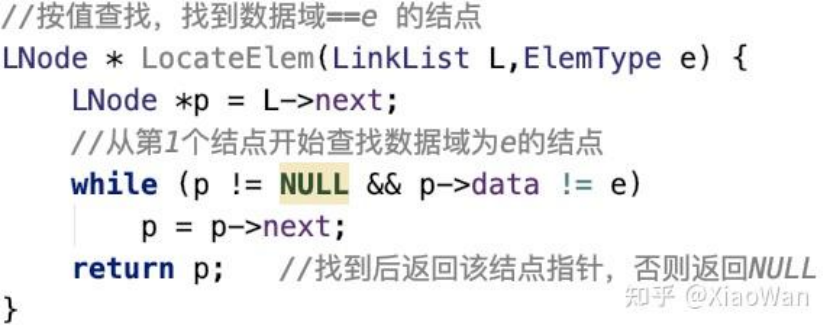
```c
LNode * LocateElem(LinkList L,ElemType e){
	//有表头单链表
	LNode *p = L->next;
	while(p != NULL && p->data ! = e){
		p = p -> next;
		return p;
	}
}
```
**结果：**

- 能找到的情况：`p` 指向了 `e` 值对应的元素，返回该元素。
- 不能找到的情况：`p` 指向了 `NULL`，指针 `p` 返回 `NULL`。

**平均时间复杂度**：$O(n)$

#### 求表的长度

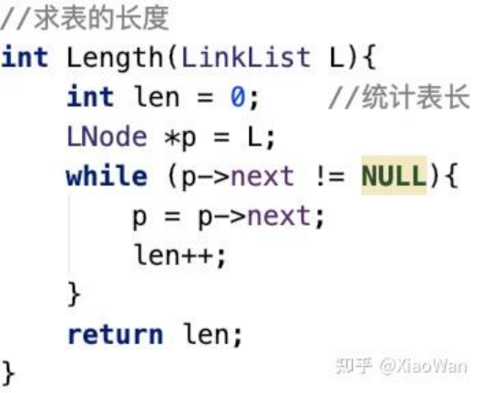

```c
int Length(LinkList L){
	int len = 0;
	LNode *p = L;
	//因为从表头开始，所以是p->next != NULL
	while(p->next != NULL){
		p = p->next;
		len +=;
	}
	return len;
}
```

**平均时间复杂度**：$O(n)$

### 单链表：建立 {#单链表建立}

#### 尾插法

每次插入元素都插入到单链表的表尾。

**方法 1**：套用之前学过的位序插入，每次都要从头开始往后面遍历，时间复杂度为 $O(n^2)$。

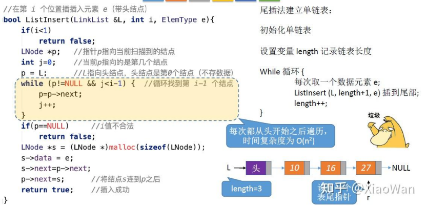

```c
bool length(LinkList *L){
	int len = 0;
	LNode *p = *L;
	while(p->next != NULL){
		p = p->next;
		len ++;
	}
	return len;
}

bool listTailInsert(LinkList *L,ElemType e){
	return listInsert(L,Length(*L)+1,e);
}
```

**方法 2**：增加一个尾指针 `r`，每次插入都让 `r` 指向新的表尾结点，时间复杂度为 $O(n)$。

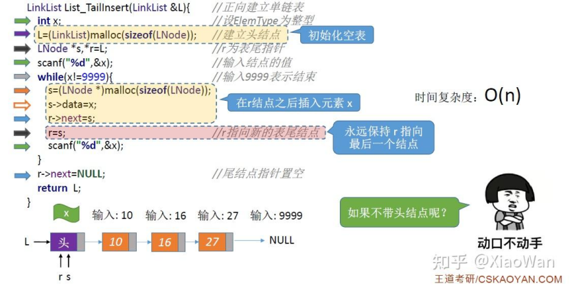

```c
//尾指针法
LinkList listTailInsert(LinkList *L){
int x;
 L = (LNode *)malloc(sizeof(LNode));
 LNode *s,*r = L; // r 指向表尾结点，开始时指向头结点
 scanf("%d",&x);
 while(x != 9999){
	s = (LNode *)malloc(sizeof(LNode)); 
	s->data = x;
	r->next = s;
	r = s; // r 指向新的表尾结点
	scanf("%d",&x);
 }
 r->next = NULL; // 尾结点指针置空
 return L;
}

```

#### 头插法
* 每次插入元素都插入到单链表的表头
- 头插法和之前学过的单链表后插操作是一样的，可以直接套用。
- `L->next=NULL;` 可以防止野指针。

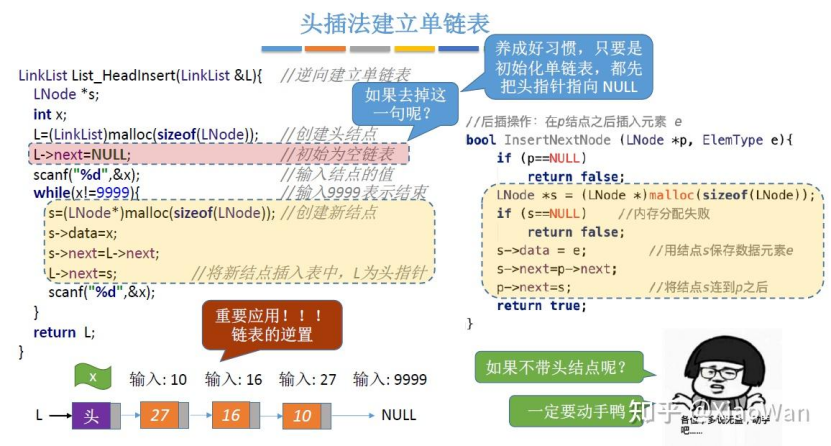

```c
LinkList ListHeadInsert(LinkList *L){
	int x;
	LNode *s;
	L= (LNode *)malloc(sizeof(LNode))
	L->next = NULL; // 防止野指针
	scanf("%d",&x);
	while(x != 9999){
		s = (LNode *)malloc(sizeof(LNode));
		s->data = x;
		s->next = L->next; // 新结点指向原头结点
		L->next = s; // 头结点指向新结点
	}
	return L;
}
```

**总结：**

- 头插法、尾插法：核心就是初始化操作、指定结点的后插操作。
- 注意设置一个指向表尾结点的指针。
- **头插法的重要应用**：链表的逆置。 